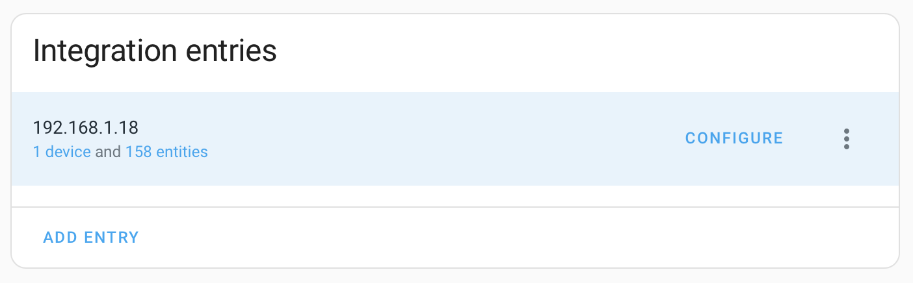
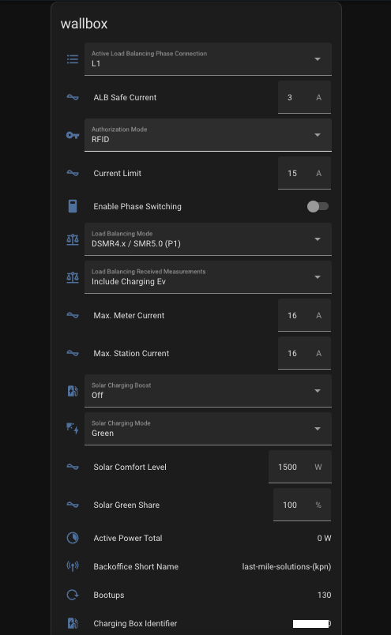

# Alfen Wallbox - HomeAssistant Integration

This is a custom component to allow control of Alfen Wallboxes in [HomeAssistant](https://home-assistant.io).

The component is a fork of the [Garo Wallbox custom integration](https://github.com/sockless-coding/garo_wallbox) and [egnerfl custom integration](https://github.com/egnerfl/alfen_wallbox)

> After reverse engineering the API myself I found out that there is already a Python libary wrapping the Alfen API.
> https://gitlab.com/LordGaav/alfen-eve/-/tree/develop/alfeneve
> 
> https://github.com/leeyuentuen/alfen_wallbox/wiki/API-paramID

## Installation

### Install using HACS (recommended)
If you do not have HACS installed yet visit https://hacs.xyz for installation instructions.

To add the this repository to HACS in your Home Assistant instance, use this My button:

[](https://my.home-assistant.io/redirect/hacs_repository/?repository=alfen_wallbox&owner=tjmjansen&category=Integration)

After installation, please reboot and add Alfen Wallbox device to your Home Assistant instance, use this My button:

[](https://my.home-assistant.io/redirect/config_flow_start/?domain=alfen_wallbox)

<details>
<summary><b><svg xmlns="http://www.w3.org/2000/svg" width="1em" height="1em" viewBox="0 0 24 24"><path fill="currentColor" d="m13.75 10.19l.63.13l4.17 2.08c.7.23 1.16.92 1.1 1.66v.26l-.9 6.12c-.06.43-.25.83-.6 1.11c-.31.3-.72.45-1.15.45h-6.88c-.49 0-.94-.18-1.27-.53L2.86 15.5l.9-1c.24-.25.62-.39.98-.37h.29L9 15V4.5a2 2 0 0 1 2-2a2 2 0 0 1 2 2v5.69z"></path></svg> Manual configuration steps</b></summary>

> - In HACS, go to the Integrations section and add the custom repository via the 3 dot menu on the top right. Enter ```https://github.com/>> leeyuentuen/alfen_wallbox``` in the Repository field, choose the ```Integration``` category, then click add.
Hit the big + at the bottom right and search for **Alfen Wallbox**. Click it, then click the download button.
> - Clone or copy this repository and copy the folder 'custom_components/alfen_wallbox' into '<homeassistant config>/custom_components/alfen_wallbox'
> - Once installed the Alfen Wallbox integration can be configured via the Home Assistant integration interface
where you can enter the IP address of the device.
</details>

### Home Assistant Energy Dashboard
The wallbox can be added to the Home Assistant Energy Dashboard using the `_meter_reading` sensor.

## Settings
The wallbox can be configured using the Integrations settings menu:



Categories can be configured to refresh at each specified update interval. Categories that are not selected will only load when the integration starts. The exception to this rule is the `transactions` category, which will load only if explicitly selected.

To locate a category, start by selecting all categories. Allow the integration to load, then find the desired entity. The category will be displayed in the entity's attributes.


Reducing the number of selected categories will enhance the integration's update speed.

## Simultaneous Use of the App and Integration
The Alfen charger allows only one active login session at a time. This means the Alfen MyEve or Eve Connect app cannot be used concurrently with the Home Assistant integration.

To manage this, the integration includes two buttons: HTTPS API Login and HTTPS API Logout.

- To switch to the Alfen app: Click the Logout button in the Home Assistant integration, then use your preferred Alfen app.
- To return to the integration: Click the Login button to reconnect the Home Assistant integration.

The HTTPS API Login Status binary sensor shows the current state of the login session.

## Services
Example of running in Services:
Note; The name of the configured charging point is "wallbox" in these examples.

### - Changing Green Share %
```
service: alfen_wallbox.set_green_share
data:
  entity_id: number.wallbox_solar_green_share
  value: 80
```

### - Changing Comfort Charging Power in Watt
```
service: alfen_wallbox.set_comfort_power
data:
  entity_id: number.wallbox_solar_comfort_level
  value: 1400
```

### - Enable phase switching
```
service: alfen_wallbox.enable_phase_switching
data:
  entity_id: switch.wallbox_enable_phase_switching
```


### - Disable phase switching
```
service: alfen_wallbox.disable_phase_switching
data:
  entity_id: switch.wallbox_enable_phase_switching
```

### - Enable RFID Authorization Mode
```
service: alfen_wallbox.enable_rfid_authorization_mode
data:
  entity_id: select.wallbox_authorization_mode
```

### - Disable RFID Authorization Mode
```
service: alfen_wallbox.disable_rfid_authorization_mode
data:
  entity_id: select.wallbox_authorization_mode
```

### - Reboot wallbox
```
service: alfen_wallbox.reboot_wallbox
data:
  entity_id: alfen_wallbox.garage
```

## Screenshots



